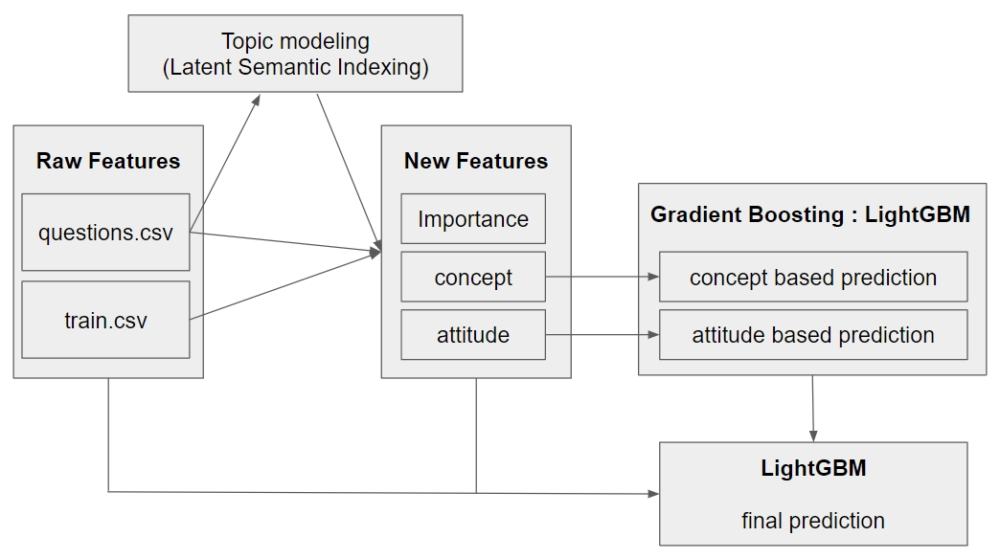

<h1>Riid LightGBM Solution</h1>

Kaggle - Riid Answer Correctness Prediction    
https://www.kaggle.com/c/riiid-test-answer-prediction   
본 repository는 data가 포함되어 있지 않으며, Kaggle Notebook에서의 구동을 전제로 합니다.   
자세한 내용은 아래 'About Codes' 항목에 설명되어 있습니다.

<h2>Project details</h2>

|||
|---|---|
|Period|2020.10 ~ 2020.12|
|Team|None|
|Rank|Top 37%|
|Accuracy|0.781|

|Tech|Detail|
|---|---|
||Main algorism|
||Prediction model|

<h2>Model Explanation</h2>

본 프로젝트는 학생들의 시간에 따른 문제 풀이 기록과 각 문제들에 대한 정보를 가지고 해당 학생이 미래에 주어진 문제에 대해 정답/오답을 예측하는 과제입니다.    
Table로 깔끔히 정리된 데이터를 가지고 있으며, 주어진 Feature 들이 십여개 정도로 적기 때문에, Neural Network 보다는 Tree 기반 Boosting 알고리즘이 적합하다고 판단했습니다. (Competition 우승 모델은 Transformer 기반으로 해당 문서를 참고하세요.)   

1. Question 테이블의 Tag 들을 활용해 Latent Semantic Indexing 으로 각각 50개, 100개, 200개의 토픽으로 분류, 새로운 Feature를 생성합니다.
2. 새로 생성한 Topic Feature 와 Question, train data를 복합적으로 분석하여, 각 문제의 중요도(Importance) Feature를 새롭게 추출합니다.
3. 해당 Importance Feature 와 기존 데이터를 활용해 각 학생의 개념 이해도(concept), 강의 수강 태도(attitude)에 해당하는 Feature를 추출합니다.
4. 획득한 concept, attitude 기반으로 예측을 수행합니다.
5. 해당 예측과 기타 모든 Feature들을 취합한 모델을 활용해 최종 예측을 수행합니다. 

<h2>About Codes</h2>

Kaggle Notebook의 session time 제한으로 인해, 본 프로젝트의 코드는 각각의 코드가 개별적으로 실행되며 각각의 파일을 생성합니다.   
또한 Train data가 포함되어 있지 않고, 코드의 파일경로가 Kaggle Notebook 기준으로 작성되었으므로, 별도의 환경에서 데이터를 받아 구동시 경로 수정이 필요합니다.

* inference
    - kaggle submission code

<h3>preprocess</h3>

* qtag_lsi
    - Question 테이블로부터 LSI 를 수행해 Topic feature 생성
* qtable_creation
    - qtag_lsi에서 생성된 feature를 활용해 importance feature를 계산
* preprocess_concept
    - importance 활용해 concept feature를 계산
* preprocess_qtable
    - concept 활용해 전처리된 최종 question table 생성
* preprocess_ttable
    - concept 활용해 전처리된 최종 train table 생성

<h3>train</h3>

* train_attitude
    - attitude 연관 feature들을 활용해 예측 모델 학습
* train_concept
    - concept 연관 feature들을 활용해 예측 모델 학습
* predict_attitude_and_concept
    - 학습된 모델들을 활용해 train table을 대상으로 예측을 수행하고 결과를 feature로 추가
* train_final
    - 최종 예측 수행

<h2>Limitation</h2>

1. concept, attitude 기반으로 학습된 모델의 결과를 다시 최종 예측의 feature로 넣으면서, overfit이 발생하는 구조적 결함을 지니고 있습니다. Competition이 마감하며 결함을 인지하여 개선할 수 없었습니다.
2. 본 모델은 학생의 연속적인 Task 수행을 복합적으로(관계지향적으로) 분석할 수 없으며, 한 순간만을 보고 예측하는 구조입니다. Competition 우승 모델은 Transformer 구조를 기반으로 하는데, 이 문제를 극복하는 훌륭한 solution입니다.
